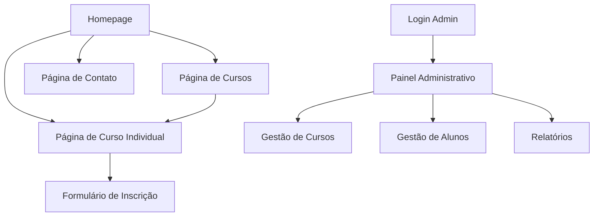

# Escola de Fotografia - Website com Copy Persuasiva e Painel Administrativo

## 1. Product Overview
Um website moderno e persuasivo para uma escola de fotografia que visa converter visitantes em alunos através de copy estratégica e oferece um painel administrativo completo para gestão de cursos, alunos e conteúdos.

O site resolve o problema de baixa conversão de visitantes em matrículas, oferecendo uma experiência otimizada para captura de leads e vendas de cursos de fotografia.

Objetivo: Aumentar as matrículas em 300% através de copy persuasiva e experiência de usuário otimizada para conversão.

## 2. Core Features

### 2.1 User Roles
| Role | Registration Method | Core Permissions |
|------|---------------------|------------------|
| Visitante | Acesso direto ao site | Pode navegar, ver cursos e se inscrever |
| Administrador | Login com credenciais | Pode gerenciar cursos, alunos, conteúdos e relatórios |

### 2.2 Feature Module
Nosso website da escola de fotografia consiste nas seguintes páginas principais:
1. **Homepage**: seção hero persuasiva, navegação principal, cursos em destaque, depoimentos, call-to-action.
2. **Página de Cursos**: catálogo completo de cursos, filtros, detalhes e preços.
3. **Página de Curso Individual**: descrição detalhada, módulos, instrutor, preço, formulário de inscrição.
4. **Página de Contato**: formulário de contato, informações da escola, localização.
5. **Painel Administrativo**: dashboard, gestão de cursos, gestão de alunos, relatórios.

### 2.3 Page Details
| Page Name | Module Name | Feature description |
|-----------|-------------|---------------------|
| Homepage | Hero Section | Apresentar proposta de valor única com copy persuasiva, imagem impactante e CTA principal |
| Homepage | Cursos em Destaque | Exibir 3-4 cursos mais populares com preços e botões de inscrição |
| Homepage | Depoimentos | Mostrar testimonials de alunos com fotos e resultados alcançados |
| Homepage | Sobre a Escola | Breve apresentação da escola, credenciais e diferenciais |
| Página de Cursos | Catálogo de Cursos | Listar todos os cursos disponíveis com filtros por categoria e nível |
| Página de Cursos | Cards de Curso | Exibir informações resumidas: título, duração, preço, nível, CTA |
| Página de Curso Individual | Detalhes do Curso | Apresentar descrição completa, objetivos, pré-requisitos e benefícios |
| Página de Curso Individual | Módulos do Curso | Listar conteúdo programático detalhado por módulos |
| Página de Curso Individual | Perfil do Instrutor | Mostrar biografia, experiência e credenciais do professor |
| Página de Curso Individual | Formulário de Inscrição | Capturar dados do aluno e processar pagamento ou lead |
| Página de Contato | Formulário de Contato | Permitir envio de mensagens com validação e confirmação |
| Página de Contato | Informações da Escola | Exibir endereço, telefone, email e horários de funcionamento |
| Painel Administrativo | Dashboard | Mostrar métricas principais: inscrições, receita, cursos ativos |
| Painel Administrativo | Gestão de Cursos | Criar, editar, excluir e gerenciar status dos cursos |
| Painel Administrativo | Gestão de Alunos | Visualizar lista de alunos, dados de contato e histórico |
| Painel Administrativo | Relatórios | Gerar relatórios de vendas, conversão e performance dos cursos |

## 3. Core Process

**Fluxo do Visitante/Aluno:**
1. Visitante acessa a homepage e é impactado pela copy persuasiva
2. Navega pelos cursos em destaque ou acessa o catálogo completo
3. Seleciona um curso de interesse e visualiza detalhes
4. Preenche formulário de inscrição com dados pessoais
5. Recebe confirmação e instruções para início do curso

**Fluxo do Administrador:**
1. Administrador faz login no painel administrativo
2. Acessa dashboard com métricas principais
3. Gerencia cursos (criar, editar, ativar/desativar)
4. Visualiza e gerencia dados dos alunos inscritos
5. Gera relatórios de performance e vendas

## 4. User Interface Design

### 4.1 Design Style
- **Cores Primárias**: Azul profissional (#2563EB), Laranja vibrante (#F97316)
- **Cores Secundárias**: Cinza escuro (#374151), Branco (#FFFFFF)
- **Estilo de Botões**: Arredondados com gradiente e efeito hover
- **Tipografia**: Inter para títulos (24-48px), Open Sans para textos (14-18px)
- **Layout**: Design moderno com cards, seções bem definidas e navegação fixa
- **Ícones**: Feather Icons ou Heroicons para consistência visual

### 4.2 Page Design Overview
| Page Name | Module Name | UI Elements |
|-----------|-------------|-------------|
| Homepage | Hero Section | Background com imagem de fotografia, título grande em branco, subtítulo persuasivo, botão CTA laranja |
| Homepage | Cursos em Destaque | Grid de 3 colunas com cards brancos, sombra sutil, imagem do curso, título, preço destacado |
| Homepage | Depoimentos | Carrossel com cards de testimonial, foto circular do aluno, texto em itálico, estrelas de avaliação |
| Página de Cursos | Catálogo | Layout em grid responsivo, filtros laterais, cards com hover effect e transições suaves |
| Página de Curso Individual | Detalhes | Layout de 2 colunas, sidebar com informações principais, conteúdo principal com tabs |
| Página de Curso Individual | Formulário de Inscrição | Modal ou seção destacada, campos organizados, validação em tempo real, botão de ação proeminente |
| Painel Administrativo | Dashboard | Layout clean com cards de métricas, gráficos coloridos, tabelas organizadas |
| Painel Administrativo | Gestão | Tabelas com ações inline, modais para edição, confirmações de exclusão |

### 4.3 Responsiveness
O produto é mobile-first com adaptação completa para desktop, incluindo otimização para touch em dispositivos móveis e navegação simplificada.