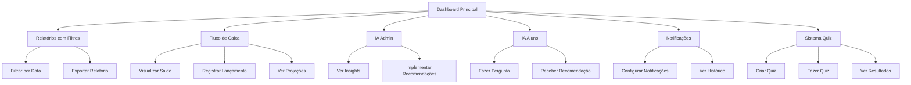

# Sistema de Melhorias Avançadas - Escola de Fotografia

## 1. Product Overview
Este documento especifica 5 funcionalidades avançadas para o sistema de gestão da escola de fotografia: filtros de data em relatórios, sistema de fluxo de caixa, inteligência artificial para administradores e alunos, sistema de notificações push e sistema de quiz personalizado por curso.

## 2. Core Features

### 2.1 User Roles
| Role | Registration Method | Core Permissions |
|------|---------------------|------------------|
| Administrador | Login existente | Acesso completo a IA, relatórios, fluxo de caixa, configurações de push |
| Aluno | Matrícula existente | Acesso a IA educacional, quiz, notificações personalizadas |
| Instrutor | Cadastro pelo admin | Criação de quiz, visualização de relatórios de turma |

### 2.2 Feature Module
Nosso sistema de melhorias consiste nas seguintes páginas principais:
1. **Relatórios com Filtros de Data**: filtros avançados de período, exportação por data, comparativos temporais.
2. **Fluxo de Caixa**: dashboard financeiro, projeções, entradas e saídas, gráficos temporais.
3. **IA para Administração**: análise preditiva, recomendações de negócio, insights automáticos.
4. **IA para Alunos**: assistente de aprendizado, recomendações personalizadas, análise de progresso.
5. **Sistema de Push**: notificações em tempo real, configurações personalizadas, histórico.
6. **Sistema de Quiz**: criação por curso, avaliação automática, relatórios de desempenho.

### 2.3 Page Details

| Page Name | Module Name | Feature description |
|-----------|-------------|---------------------|
| Relatórios Financeiros | Filtros de Data | Implementar seletores de data início/fim, filtros por mês/trimestre/ano, comparação entre períodos |
| Relatório de Matrículas | Filtros de Data | Adicionar filtros por data de matrícula, período de conclusão, data de pagamento |
| Contas a Receber | Filtros de Data | Filtros por data de vencimento, data de pagamento, período de inadimplência |
| Dashboard Fluxo de Caixa | Visão Geral | Exibir saldo atual, entradas previstas, saídas programadas, gráfico de tendência |
| Fluxo de Caixa | Lançamentos | Registrar entradas/saídas, categorização, anexar comprovantes, programar recorrências |
| Fluxo de Caixa | Projeções | Calcular projeções baseadas em histórico, cenários otimista/pessimista/realista |
| IA Admin Dashboard | Análise Preditiva | Prever evasão de alunos, identificar cursos com maior potencial, otimizar preços |
| IA Admin Dashboard | Recomendações | Sugerir ações para aumentar receita, melhorar retenção, otimizar recursos |
| IA Aluno Dashboard | Assistente Virtual | Responder dúvidas sobre curso, técnicas fotográficas, equipamentos |
| IA Aluno Dashboard | Recomendações | Sugerir exercícios personalizados, próximos cursos, técnicas para praticar |
| Central de Notificações | Configurações Push | Configurar tipos de notificação, horários, canais de entrega |
| Central de Notificações | Histórico | Visualizar notificações enviadas, status de entrega, métricas de engajamento |
| Sistema de Quiz | Criação | Criar quiz por curso/módulo, definir questões, configurar pontuação |
| Sistema de Quiz | Avaliação | Realizar quiz, feedback automático, acompanhar progresso |
| Sistema de Quiz | Relatórios | Visualizar desempenho individual/turma, identificar dificuldades |

## 3. Core Process

### Fluxo de Filtros de Data
1. Usuário acessa página de relatório
2. Seleciona filtros de data (início, fim, período pré-definido)
3. Sistema aplica filtros e atualiza dados
4. Usuário pode exportar relatório filtrado

### Fluxo de Caixa
1. Admin acessa dashboard de fluxo de caixa
2. Visualiza saldo atual e projeções
3. Registra novos lançamentos (entrada/saída)
4. Sistema atualiza automaticamente projeções
5. Gera relatórios e gráficos de tendência

### Fluxo de IA Admin
1. Sistema coleta dados de matrículas, pagamentos, frequência
2. IA processa dados e gera insights
3. Admin visualiza recomendações no dashboard
4. Admin pode implementar sugestões da IA

### Fluxo de IA Aluno
1. Aluno acessa assistente virtual
2. Faz perguntas sobre curso ou técnicas
3. IA fornece respostas personalizadas
4. Sistema registra interações para melhorar recomendações

### Fluxo de Notificações
1. Sistema detecta evento (novo curso, pagamento vencido, etc.)
2. Verifica configurações de notificação do usuário
3. Envia notificação via canal configurado
4. Registra entrega e engajamento

### Fluxo de Quiz
1. Instrutor cria quiz para curso específico
2. Aluno acessa quiz durante ou após aula
3. Responde questões e recebe feedback imediato
4. Sistema registra pontuação e progresso
5. Gera relatórios de desempenho

## 4. User Interface Design

### 4.1 Design Style
- **Cores primárias**: Azul (#3B82F6), Verde (#10B981) para sucesso, Vermelho (#EF4444) para alertas
- **Cores secundárias**: Cinza (#6B7280) para textos, Branco (#FFFFFF) para fundos
- **Estilo de botões**: Arredondados com sombra sutil, efeito hover suave
- **Fontes**: Inter para textos gerais, tamanhos 14px (corpo), 18px (títulos), 24px (cabeçalhos)
- **Layout**: Cards com bordas arredondadas, navegação lateral fixa, design responsivo
- **Ícones**: Lucide React para consistência, estilo outline

### 4.2 Page Design Overview

| Page Name | Module Name | UI Elements |
|-----------|-------------|-------------|
| Relatórios com Filtros | Seletores de Data | DatePicker duplo, botões de período rápido, botão "Aplicar Filtros" azul |
| Dashboard Fluxo de Caixa | Cards de Resumo | Cards com ícones coloridos, valores em destaque, gráficos Chart.js |
| Fluxo de Caixa | Formulário de Lançamento | Modal com campos organizados, upload de anexos, botões de ação |
| IA Admin | Painel de Insights | Cards de recomendações, gráficos preditivos, botões de ação rápida |
| IA Aluno | Chat Interface | Interface de chat moderna, bolhas de mensagem, botão de envio |
| Notificações | Centro de Controle | Toggle switches, cards de configuração, histórico em lista |
| Sistema Quiz | Editor de Quiz | Interface drag-and-drop, preview em tempo real, botões de salvar |

### 4.3 Responsiveness
Todas as funcionalidades serão mobile-first com adaptação para desktop. Interface touch-friendly com botões de tamanho adequado (mínimo 44px). Navegação otimizada para dispositivos móveis com menu hambúrguer e gestos intuitivos.